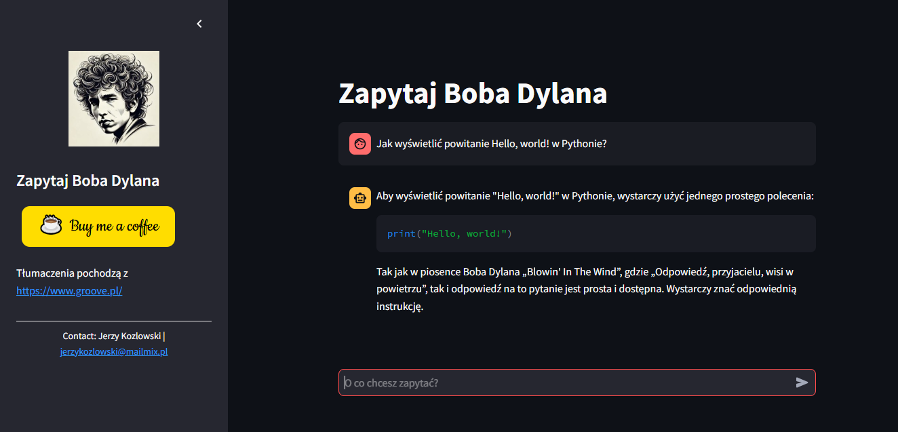

# Zapytaj Boba Dylana

Aplikacja jest unikalnym narzędziem dla fanów twórczości Boba Dylana oraz wszystkich miłośników muzyki i poezji. Dzięki wykorzystaniu sztucznej inteligencji, użytkownicy mogą zadawać pytania lub poruszać dowolne tematy, a aplikacja odpowiada w stylu eksperta znającego twórczość Dylana na wylot. W odpowiedziach AI wplata cytaty z jego piosenek, podaje tytuły i odnosi się do motywów przewodnich utworów.

To nie tylko ciekawostka dla fanów, ale także sposób na głębsze zanurzenie się w świat poezji i filozofii zawartych w tekstach Dylana. Aplikacja prezentuje jego twórczość w nowym świetle, łącząc analizę artystyczną z interaktywną rozmową. Może być doskonałym narzędziem edukacyjnym, inspiracją dla artystów czy po prostu rozrywką dla tych, którzy kochają inteligentne i nietuzinkowe treści.

Krótko mówiąc, to idealny przykład, jak można połączyć sztukę z nowoczesną technologią, tworząc aplikację, która bawi, uczy i inspiruje.

<a href="https://ask-dylan-peh8h.ondigitalocean.app/" class="md-button md-button--primary">Przejdź do aplikacji</a>

