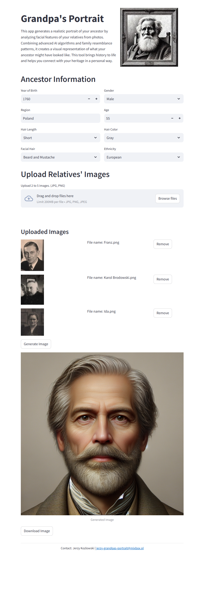

# Grandpa's Portrait

Aplikacja wykorzystująca sztuczną inteligencję do generowania zdjęcia przodka, którego wizerunku nie masz i nie możesz go umieścić w swoim drzewie genealogicznym.

Zdjęcie jest generowane na podstawie posiadanych przez Ciebie informacji o przodku oraz zdjęć innych jego krewnych.

W aplikacji zastosowano wiele zaawansowanych narzędzi:

- **Model FaceNet512** - zamienia twarze ze zdjęć krewnych na reprezentację wektorową.
- Automatycznie wygenerowana baza opisów tekstowych twarzy jest zdeponowania w wektorowej bazie danych **Qdrant**.
- **Universal Sentence Encoder** - wytworzył do tych opisów ich reprezentację wektorową.
- Te wektory są porównywane ze sobą i wybierany jest najlepiej dopasowany opis do zdjęcia. 
- Wybrany opis jest wysyłany do modelu AI **Dall-E** w celu wygenerowania zdjęcia.
- I jeszcze drobnostka - **Chat GPT-4o-mini** z kolei zamienia wybrany kraj, w którym żył nasz przodek na przymiotnik potrzebny do opisu ubioru który był powszechny w tym kraju.

Miłej zabawy! 

<a href="https://coral-app-w7ema.ondigitalocean.app/" class="md-button md-button--primary">Przejdź do aplikacji</a>

