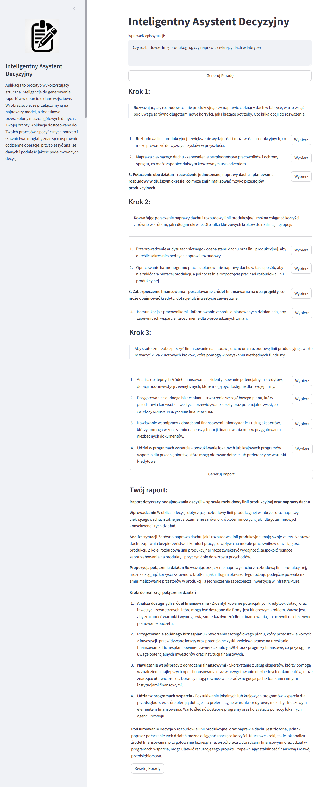

# Inteligentny Asystent Decyzyjny

Wypróbuj aplikację, która na podstawie krótkiego opisu Twojego problemu kreatywnie go rozwija, podając konkretne rozwiązania i metody działania — tak jak drzewo decyzyjne. Opiera się ona na inteligentnych odpowiedziach generowanych przez model sztucznej inteligencji.

## Przejście na Zaawansowany Model AI
Pomyśl, że przełączamy ją na najnowszy, najbardziej zaawansowany model AI, dodatkowo przeszkolony na szczegółowych danych z Twojej branży. Powstanie Twoja aplikacja, która rozumie specyficzne potrzeby i terminologię nawet niszowego sektora, może stać się niezastąpionym narzędziem w codziennej pracy.

## Korzyści
- **Usprawnienie Procesów**: Spersonalizowane narzędzie znacząco usprawni Twoje procesy.

- **Świeże Spojrzenie**: Oferuje świeże spojrzenie na problemy i proponuje innowacyjne rozwiązania.

- **Kompleksowe Wsparcie**: Zamiast tracić czas na samodzielne analizowanie wszystkich możliwych ścieżek, otrzymujesz kompleksowe wsparcie w podejmowaniu decyzji.

- **Wyższa Jakość Decyzji**: Przyspiesza realizację zadań i podnosi jakość podejmowanych decyzji, dostarczając różnorodnych perspektyw i pomysłów.

## Zastosowanie w Codziennej Pracy
Wyobraź sobie, jak taka aplikacja mogłaby pomóc w codziennych wyzwaniach:

- **Planowanie Projektów**: Ułatwia planowanie projektów.

- **Rozwiązywanie Problemów**: Pomaga w rozwiązywaniu konkretnych problemów.

- **Strategia Rozwoju**: Wspiera strategię rozwoju.

Dzięki tej aplikacji możesz skupić się na kluczowych aspektach swojej pracy, mając pewność, że masz dostęp do kreatywnych i przemyślanych rozwiązań wspieranych przez najnowszą technologię AI.

<a href="https://iad-m3mqd.ondigitalocean.app/" class="md-button md-button--primary">Przejdź do aplikacji</a>

