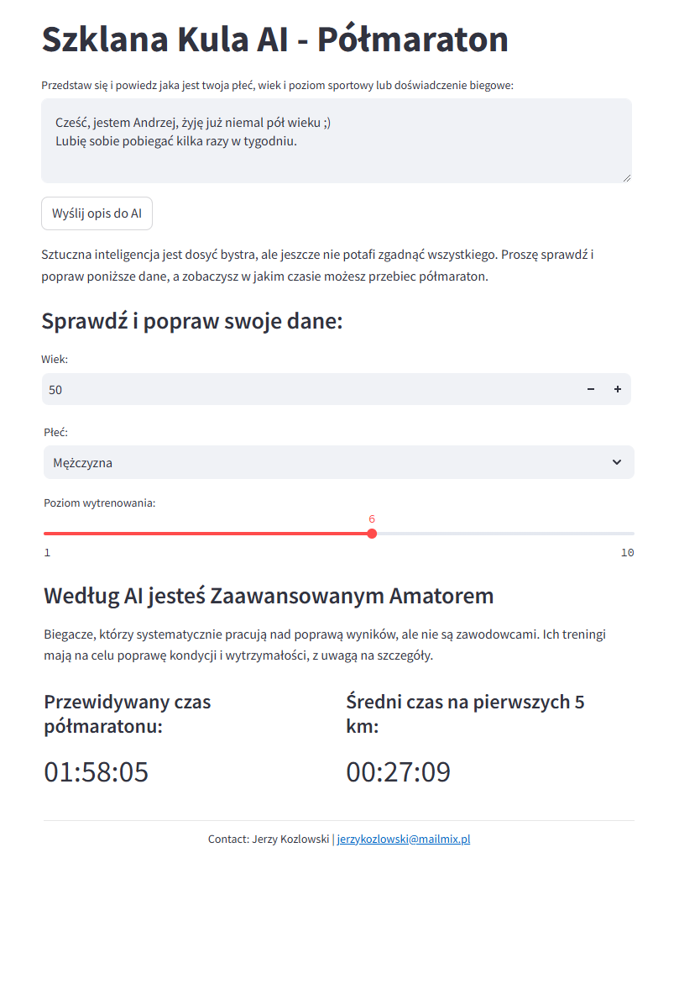

# Szklana kula AI - Półmaraton

Aplikacja wykorzystująca sztuczną inteligencję do przewidywania czasu w półmaratonie.

Na podstawie wyników wszystkich biegaczy dwóch edycji Półmaratonu Wrocławskiego wyliczamy średni czas dla danej kategorii wiekowej i płci. Dodatkowo bierzemy pod uwagę również poziom wytrenowania zawodnika.

Wszystkich tych danych nawet nie musisz podawać, wystarczy, że napiszesz krótkie zdanie o sobie, a sztuczna inteligencja wywnioskuje ile masz lat, jakiej jesteś płci i jaki poziom sportowy reprezentujesz. 

Oczywiście nikt nie jest nieomylny, dlatego zawsze możesz poprawić dane, które zaproponuje Tobie AI.

Miłej zabawy! 

<a href="https://plankton-app-n8ty3.ondigitalocean.app/" class="md-button md-button--primary">Przejdź do aplikacji</a>

